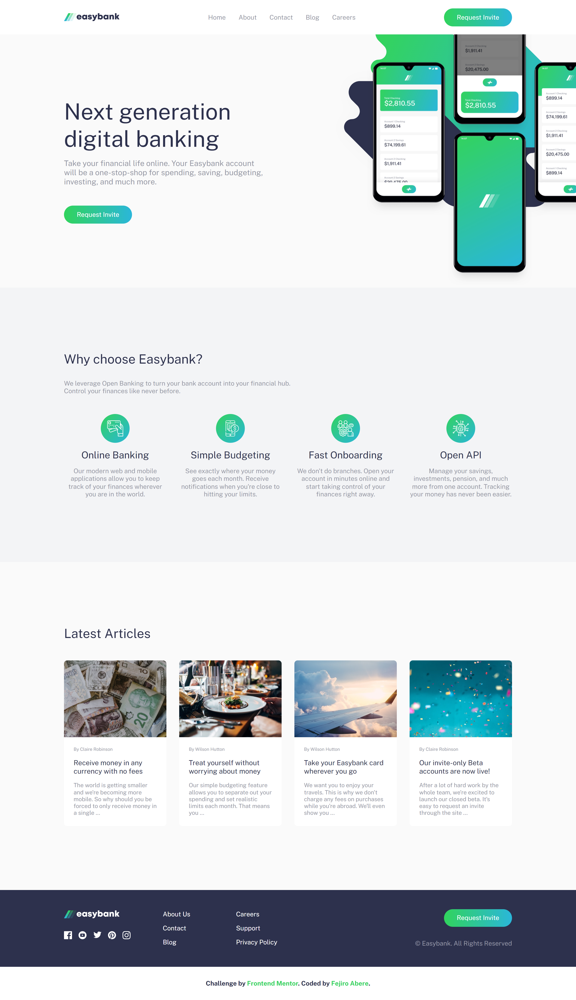

# Frontend Mentor - Easybank landing page solution

This is a solution to the [Easybank landing page challenge on Frontend Mentor](https://www.frontendmentor.io/challenges/easybank-landing-page-WaUhkoDN). Frontend Mentor challenges help you improve your coding skills by building realistic projects.

## Table of contents

- [Overview](#overview)
  - [The challenge](#the-challenge)
  - [Screenshot](#screenshot)
  - [Links](#links)
- [My process](#my-process)
  - [Built with](#built-with)
  - [What I learned](#what-i-learned)
- [Author](#author)
- [Acknowledgments](#acknowledgments)

## Overview

### The challenge

Users should be able to:

- View the optimal layout for the site depending on their device's screen size
- See hover states for all interactive elements on the page

### Screenshot

Full size screenshot of website in 1440px


### Links

- Solution URL: [Solution URL](https://your-solution-url.com)
- Live Site URL: [Live Site URL](https://fejiro001.github.io/easybank-landing-page-master/)

## My process

### Built with

- Semantic HTML5 markup
- SCSS
- CSS custom properties
- Flexbox
- CSS Grid
- Mobile-first workflow

### What I learned

open popup menu on clicking the hamburger icon

```css
.open-menu {
  background-color: $white;
  display: flex;
  flex-direction: column;
  align-items: center;
  justify-content: center;
  gap: $big-gap;
  height: fit-content;
  margin: 6rem 2rem;
  padding: 2rem 1rem;
  border-radius: 0.4rem;
  position: absolute;
  box-shadow: 0 2em 20em 2em #030303;
  left: 0;
  right: 0;

  @media (min-width: 900px) {
    flex-direction: row;
    // removes absolute positioning
    position: static;
    // remove margin and padding
    margin: 0;
    padding: 0;
    box-shadow: none;
  }
}
```

```js
let isMenuOpen = false;
function toggleMenuIcon() {
  let hamburger = "./images/icon-hamburger.svg";
  let close_hamburger = "./images/icon-close.svg";

  toggleMenu.src = isMenuOpen ? hamburger : close_hamburger;
  isMenuOpen = !isMenuOpen;
  console.log(toggleMenu.src);
}
```

## Author

- Frontend Mentor - [@Fejiro001](https://www.frontendmentor.io/profile/Fejiro001)
- Twitter - [@aberefejiro](https://twitter.com/aberefejiro)

## Acknowledgments

- [Igbalode Engineer](https://x.com/FirstClassMe?s=20) - Helped me to fix an issue I had with toggling image change when clicked
